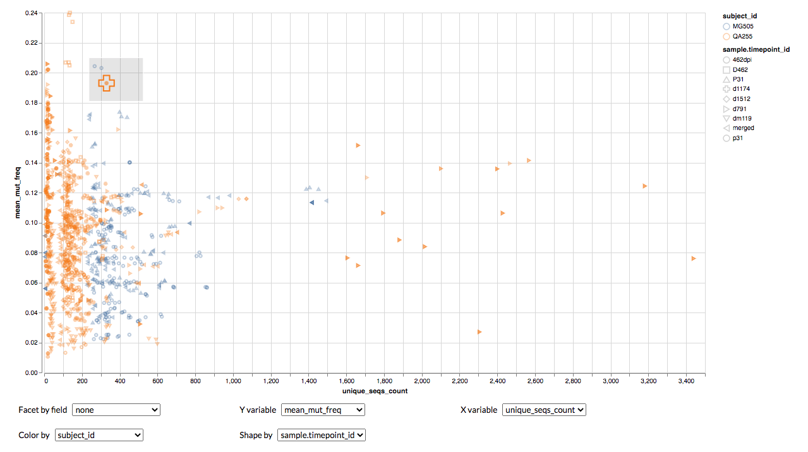
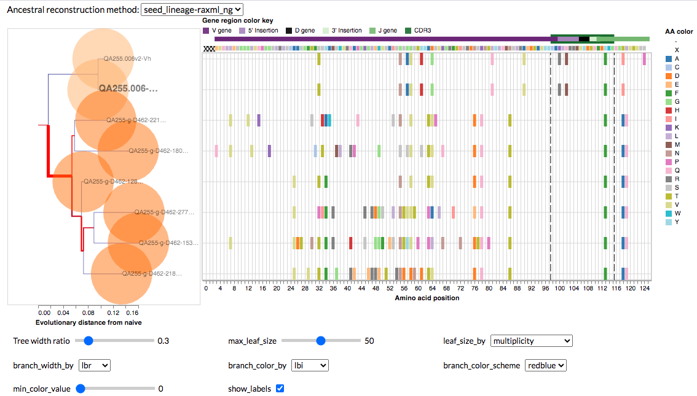

# Olmsted


*After landscape architect [Fredrick Law Olmsted](https://en.wikipedia.org/wiki/Frederick_Law_Olmsted)*

Olmsted is an open-source tool for visualizing and exploring B cell lineages. You can visit a live demo application at <http://olmstedviz.org>, and use the [guide below](https://github.com/matsengrp/olmsted#guide) to direct your time there.

## Abstract

In the human immune system, affinity maturation of B cell receptor sequences coding for immunoglobulins (i.e. antibodies) begins with a diverse pool of randomly generated naive sequences and leads to a collection of evolutionary histories.
It is now common to apply high-throughput DNA sequencing to the B cell repertoire and then reconstruct these evolutionary histories using specialized algorithms.
However, researchers often lack the tools to explore these reconstructions in the detail necessary to, for example, choose sequences for further functional, structural, or biochemical studies.
We aim to address this need with Olmsted: a browser-based application for visually exploring B cell repertoires and clonal family tree data.
Olmsted allows the user to scan across collections of clonal families at a high level using summary statistics, and then hone in on individual families to visualize phylogenies and mutations.
This will enable lab-based researchers to more quickly and intuitively identify lineages of interest among vast B cell sequencing datasets, and move forward with in-depth analyses and testing of individual antibodies.

## Installation

Olmsted's dependencies are described in the Dockerfile. We recommend that you run Olmsted inside a Docker container, since this will make installation much easier (if you're new to Docker, read [this](http://erick.matsen.org/2018/04/19/docker.html)). However, you can also install the dependencies by hand, in which case you should clone the repository and run each command in the [Dockerfile](https://github.com/matsengrp/olmsted/blob/master/Dockerfile) that's on a line starting with RUN (treat WORKDIR as cd).

## Preparing input data

### Data processing dependencies
The necessary python depencies for processing input data are installed in the Docker image using conda.
You may also install them directly on your machine by running the `conda install` command from the [Dockerfile](https://github.com/matsengrp/olmsted/blob/master/Dockerfile).

### Input format

Olmsted input data is through a [JSON schema](https://json-schema.org/) that extends the [AIRR schema](https://github.com/airr-community/airr-standards/blob/master/specs/airr-schema.yaml).
For a human-readable version of the schema, see [olmstedviz.org/schema.html](http://www.olmstedviz.org/schema.html) or view [schema.html](https://github.com/matsengrp/olmsted/blob/master/schema.html) on [htmlpreview.github.io](https://htmlpreview.github.io)

### Validation
Input data is processed using the script `bin/process_data.py` to ensure required fields required by the schema are valid.
The script takes any number of JSON files, each one containing one complete dataset.
It breaks this apart into files summarizing individual records in the dataset (e.g. clonal families, trees) which can be served to the Olmsted client and visualized.

Here is an example of how to parse input JSON files using `bin/process_data.py` in Docker:

1. Change to the directory where you have your input JSON file(s) (this example uses the data from this repository):
```
git clone https://github.com/matsengrp/olmsted.git && cd olmsted/example_data
```

2. Run `bin/process_data.py` in Docker using `-v` to mount the current directory to `/data` in the container: 
```
docker run --rm -v $(pwd):/data quay.io/matsengrp/olmsted bin/process_data.py -i /data/full_schema_dataset.json -o /data/build_data -n inferred_naive
```

Run ` ./bin/process_data.py --help` for more on how to run that Python script to parse your data according to the schema.

## Deployment with Docker

1. Install [Docker](https://www.docker.com/get-started)
2. Choose a port number available to you locally, e.g. 8080
3. Choose a [version tag](https://quay.io/repository/matsengrp/olmsted?tab=tags) e.g. `v2.1.1-11-gec852b7` - we recommend that you choose a specific tag even if you want the latest version, i.e. that you don't use the `latest` tag, if you want to be able to reproduce your efforts later.
4. Run:
```
docker run -p 8080:3999 quay.io/matsengrp/olmsted
```
5. Navigate to `localhost:8080` in your browser to see the application.

To run an interactive session in the container:
```
docker run -it quay.io/matsengrp/olmsted /bin/bash
```

### Specifying input data
The command that starts the Olmsted local server is `npm start localData`, followed by the location of your input JSON(s) (which should be the output, i.e. `-o`, from `bin/process_data.py` above).
To run on your own data instead of the example data, you need to point Docker to your data.
To access files on your machine from within the Docker container, or to persist output beyond the container, you must [use volumes by specifying -v](http://erick.matsen.org/2018/04/19/docker.html#making-a-directory-available-inside-of-a-container). 

For example, if you wanted to use the example data in this repo, that would look like this:
```
git clone https://github.com/matsengrp/olmsted.git && cd olmsted/example_data/build_data
docker run -p 8080:3999 -v $(pwd):/data quay.io/matsengrp/olmsted npm start localData /data
```

## Deploying without using Docker

Run `npm start localData /local/data/path 8080` (after installing the necessary dependencies specified in the [Dockerfile](https://github.com/matsengrp/olmsted/blob/master/Dockerfile)) and navigate to `localhost:8080` in your browser to see the application.

## Static Build

Olmsted is designed to statically compile as a single page app, which can then be deployed using a simple CDN setup.

To create a static deployment, run `npm run build` from within the project directory (the path to your clone of this repository or `/usr/src/app` in the Docker image). 
This will generate most of a deployment in a `deploy` directory.
To complete the static deployment, you simply have to place the data you want to deploy at `deploy/data`.

You can test the local static build by running the following:

```
cd deploy
python -m SimpleHTTPServer 4000
```

Once you've verified that your static build works, you simply have to deploy the contents to a static file server or CDN.

If you're content deploying with AWS S3, there is a deploy script at `bin/deploy.py` which you can use to push your static deployment up to an S3 bucket.
For deploy script usage run `./bin/deploy.py -h`.
To see what you need to do on the S3 side to acitvate website hosting for a bucket, see: <https://docs.aws.amazon.com/AmazonS3/latest/dev/WebsiteHosting.html>

## Guide

Upon launching Olmsted and navigating in a browser to the appropriate address (or using the example at http://olmstedviz.org), you will find the home page with a table of the available datasets:


Click on a row to load the dataset into the browser's memory.
Click *Explore!* to visually explore loaded datasets.

### Clonal Families Section (AKA "scatterplot")

The *Clonal Families* section represents each clonal family as a point in a scatterplot:



Choose an immunoglobulin locus to restrict the clonal families in the scatterplot to that locus - the default is immunoglobulin gamma, or *igh* (where *h* stands for heavy chain).
In order to visualize all clonal families from all loci in the dataset at once, choose "ALL" in the locus selector.
By default, the scatterplot maps the number of unique members in a clonal family, `unique_seqs_count`, to the x-axis, and the average mutation frequency among members of that clonal family, `mean_mut_freq`, to the y-axis.
However, you may configure both axes as well as the color and shape of the points to map to a range of fields, including sequence sampling time (see below).

For comparison of subsets, you may *facet* the plot into separated panels according to data values for a range of fields:


Interact with the plot by clicking and dragging across a subset of points or clicking individual points to filter the resulting clonal families in the *Selected clonal families* table below.

### Selected Clonal Families Section (AKA "table")
Below the scatterplot, the full collection or selected subset of clonal families appears in a table including a visualization of the recombination event resulting in the naive antibody sequence and a subset of clonal family metadata:


Each row in the table represents one clonal family.
The table automatically selects the top clonal family according to the sorting column.
Click on the checkbox in the "Select" column in the table to select a clonal family for further visualization.
Upon selecting a clonal family from the table, the phylogenetic tree(s) corresponding to that clonal family (as specified in the input JSON) is visualized below the table in the Clonal family details section.

### Clonal Family Details Section (AKA "tree" and "alignment")
For a selected clonal family, its phylogenetic tree is visualized below the table in the *Clonal family details* section:




Select among any alternate phylogenies using the *Ancestral reconstruction method* menu.
Note that these ancestral reconstruction methods are according to those specified in the input data according to the phylogenetic inference tool used to produce them - Olmsted does not perform ancestral reconstruction (or any phylogenetic inference at all). 
Alongside the tree is an alignment of the sequences at the tree's tips.
Colors indicate amino acid mutations at each position that differs from the sequence at the root of the tree (typically the family's inferred naive antibody sequence).
Scroll while hovering over the tree to zoom in and out.
Click and drag the zoomed view to pan in a traditional map-style interface.
The alignment view on the right zooms in the vertical dimension according to the zoom status of the tree.
The tree's leaves use pie charts to show the multiplicity (i.e. the number of downsampled and deduplicated sequences) represented by a given sequence, colored according to sampling timepoint. See [the schema](http://www.olmstedviz.org/schema.html) for more detailed field descriptions.

Note that often in example data the number of sequences in a clonal family has been downsampled to build a tree (see downsampled_count, downsampling_strategy in [the schema](http://www.olmstedviz.org/schema.html)), which explains why a clonal family might be listed in the table as having a few thousand unique sequences, but upon selecting the clonal family, the corresponding tree visualization only contains 10s or 100s of sequences.

Use the interface below the tree to configure:

- Maximum width of the tree window with respect to the alignment window
- Field mapped to the size of tree leaves (pie charts)
- Maximum size of the tree leaves
- Tree tip labels
- Fields mapped to branch width and color


In order to get more details about a particular lineage in the tree, click on a leaf's label (or circle if the labels are hidden) - the *Ancestral Sequences* section will appear below the tree.

### Ancestral Sequences Section (AKA "lineage")

The *Ancestral Sequences* section displays an alignment of the selected sequence with its ancestral lineage starting from the naive sequence:


Mutations from the naive sequence are shown as in the *Clonal Family Details* section.

## Versioning

We use git tags to tag [releases of Olmsted](https://github.com/matsengrp/olmsted/releases) using the [semver](https://semver.org/) versioning strategy.

Tag messages, e.g. `Olmsted version 2.0.1 ; uses schema version 2.0.0`, contain the [version of the input data schema](https://github.com/matsengrp/olmsted/blob/master/bin/process_data.py#L18) with which a given version of Olmsted is compatible.

The tagged release's major version of Olmsted should always match that of its compatible schema version; should we need to make breaking changes to the schema, we will bump the major versions of both Olmsted and the input schema.


## Implementation notes

This application relies on React.js and Redux for basic framework, and Vega and Vega-Lite for the interactive data visualizations.


## License and copyright

Copyright 2019 Christopher Small, Eli Harkins, and Erick Matsen.
Forked from [Auspice](https://github.com/nextstrain/auspice), copyright 2014-2018 Trevor Bedford and Richard Neher.

Source code to Olmsted is made available under the terms of the [GNU Affero General Public License](LICENSE.txt) (AGPL). Olmsted is distributed in the hope that it will be useful, but WITHOUT ANY WARRANTY; without even the implied warranty of MERCHANTABILITY or FITNESS FOR A PARTICULAR PURPOSE.  See the GNU Affero General Public License for more details.
